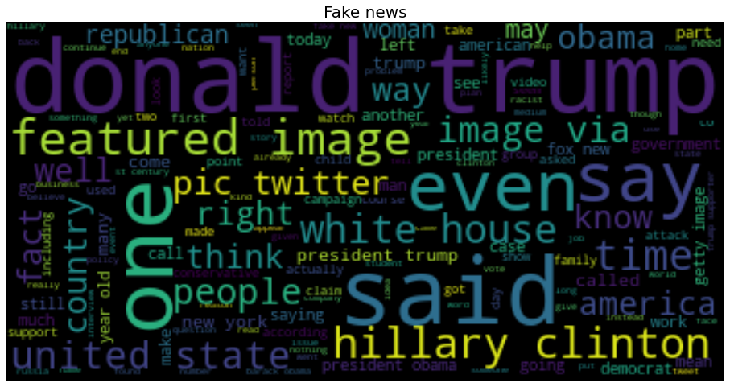
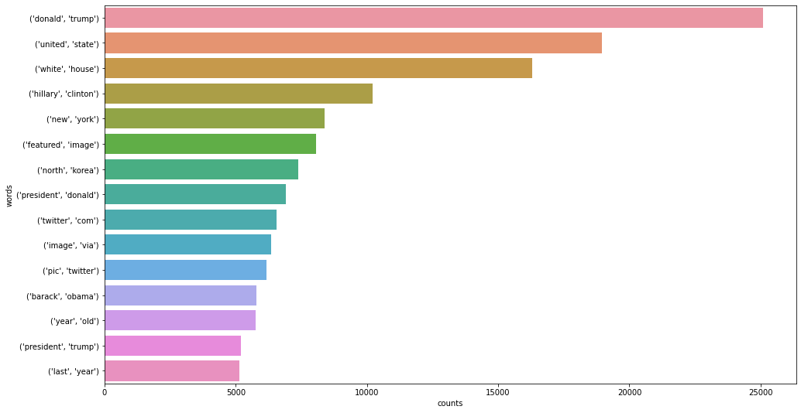

# Real/Fake news analysis and prediction

Analysis of the Kaggle dataset https://www.kaggle.com/clmentbisaillon/fake-and-real-news-dataset

### Dataset preview:

## Tasks done

- Preprocessing of the data

- Wordclouds, N-grams

- Sentiment analysis

- LDA for topic modeling

- Gephi graph

- Fake/Real prediciton (ML and LSTM)

